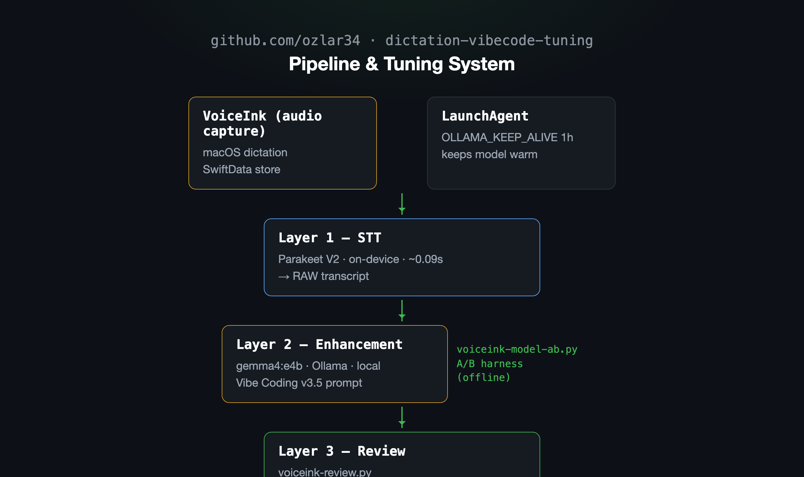

# dictation-vibecode-tuning

Tuning a **fully-local** dictation pipeline — on-device speech-to-text plus a
local-LLM enhancement pass — for a developer who dictates a mix of prose and the
occasional command, path, flag, or list to an AI coding assistant.

This repo is less "here's a tool" and more **"here's a multi-week empirical
tuning loop and what it found."** The scripts are the instruments; the findings
are the point.

> **Not affiliated with VoiceInk.** [VoiceInk](https://tryvoiceink.com) is a
> separate commercial macOS app by Prakash Joshipax. Nothing here is a fork or a
> redistribution of it. This is unofficial tooling and notes built *around* it —
> the same ideas apply to any STT-plus-local-LLM dictation setup.

## The stack

| Layer | Choice | Why |
|---|---|---|
| Speech-to-text | Parakeet V2 (`parakeet-tdt-0.6b-v2`), on-device | ~0.09s, effectively free, never the bottleneck |
| Enhancement | Ollama `gemma4:e4b`, local | punctuation / fillers / formatting cleanup, no cloud, no API cost |
| Enhancement prompt | custom **"Vibe Coding"** v3.5, system-template OFF | the actual tuned artifact ([`prompt/vibe-coding.md`](prompt/vibe-coding.md)) |

Everything runs on-device. No API keys, no per-token cost, no audio or text
leaving the machine — which is the whole reason for doing the enhancement with a
local model instead of a cloud one.

## What's in here

```
prompt/vibe-coding.md          the tuned v3.5 enhancement prompt + extract script
scripts/voiceink-review.py     read-only reader of the SwiftData store: RAW vs ENHANCED pairs
scripts/voiceink-model-ab.py   controlled A/B of enhancement models at the Ollama layer
launchagents/                  the OLLAMA_KEEP_ALIVE LaunchAgent (the latency fix)
examples/                      illustrative: patching the prompt programmatically
docs/architecture.png          pipeline & tuning system diagram
```

## Pipeline



<details>
<summary>Text version</summary>

```
[VoiceInk (audio capture)]   [LaunchAgent: OLLAMA_KEEP_ALIVE 1h]
          │                              │
          └──────────────┬───────────────┘
                         ▼
              [Layer 1 — STT: Parakeet V2]
                on-device · ~0.09s
                → RAW transcript
                         │
                         ▼
          [Layer 2 — Enhancement: gemma4:e4b]   ◄── voiceink-model-ab.py
              Ollama · local · Vibe Coding v3.5       (A/B harness)
                → ENHANCED text
                         │
                         ▼
              [Layer 3 — Review]
              voiceink-review.py
              RAW vs ENHANCED · 3-layer miss taxonomy
```

</details>

---

## Findings

### 1. The three-layer miss taxonomy

The single most useful idea in this whole exercise: **when a dictation comes out
wrong, the error lives in exactly one of three layers**, and conflating them
sends you tuning the wrong thing.

1. **Transcription miss** — the STT model genuinely misheard the audio. No prompt
   change can fix this; it's an acoustic/model problem.
2. **Enhancement divergence** — STT heard it right, but the enhancement LLM
   rewrote, over-compressed, or mis-formatted it. *This* is what prompt tuning
   addresses.
3. **Correct** — the output is faithful (including legitimate cleanup like filler
   removal or punctuation).

`scripts/voiceink-review.py` exists to make this split visible: it pulls the RAW
transcript (`ZTEXT`) and the ENHANCED output (`ZENHANCEDTEXT`) side by side from
the store, so every judgment call starts from "did the model mishear it, or did
the prompt mangle it?" Tuning without that split means guessing.

### 2. The bigger enhancement model was a dead end (and not for the obvious reason)

The intuitive move — "use a larger model for better cleanup" — fails for
`gemma4:12b`, for three independent reasons, only one of which is the one people
assume:

- **It's a thinking model that returns *empty* content** unless the request sends
  `think:false`. VoiceInk's request doesn't include that flag and offers no
  toggle ([open feature request #589](https://github.com/Beingpax/VoiceInk/issues/589)).
- **It can't be salvaged with a derived model.** On Ollama 0.30.6 a non-thinking
  variant isn't bakeable via Modelfile — the `gemma4` renderer is auto-assigned
  from the architecture and un-removable, and `PARAMETER think false` is rejected.
- **It doesn't even win on quality.** An n=20 offline A/B put 12b near-even with
  e4b (9 ties / 5 each / 1 toss-up). Its *losses* were correctness-level: on
  natural-language dictation it over-renders prose into symbols (the spoken words
  "slash commands" / "dash" become `/commands` / `--`) and invents punctuation.
  Its wins were only nice-to-haves (kept list digits, normalized identifiers).
  And it runs ~1.6x slower.

So the small model isn't a compromise — for this task it's the *correct* choice,
and the experiment is what proved it rather than assumed it. (`gemma4:12b` is
parked until #589 ships.)

### 3. The latency you feel is cold-load, not inference

If local dictation feels slow, the instinct is "the model is too big." Wrong
layer. STT (Parakeet) is ~0.09s and never the problem. The felt stall is the
enhancement model **cold-loading**: `gemma4:e4b` (9.6 GB) unloads on Ollama's
idle timeout and reloads (3-10s) on the first dictation after a gap.

The fix is one environment variable, not a smaller model:

```
launchctl setenv OLLAMA_KEEP_ALIVE 1h
```

(Shipped as a LaunchAgent in [`launchagents/`](launchagents/) so it survives
reboots.) Pinned warm, enhancement is sub-second.

### 4. ...and a smaller model is the *wrong* fix for latency

The tempting shortcut to "fix" the stall — drop to `gemma4:e2b` — was tested and
rejected. e2b is ~1.7x faster *per token*, but: (a) that speedup is invisible
once the model is warm, (b) it does nothing for the cold-load problem (the only
latency you actually feel), and (c) it drops clauses and corrupts numbers. The
right lever was keeping e4b warm, not trading accuracy for a speedup you can't
perceive. `scripts/voiceink-model-ab.py` is the harness that measured this —
cold-load vs warm latency and tokens/sec per model, over a fixed set of real
rows, with the live prompt held constant so the model is the only variable.

---

## A worked example

The clearest enhancement-divergence case, and the one a specific prompt rule was
written to kill. An early prompt version collapsed a full question down to a bare
command:

```
RAW:       Can you run slash clear, then show me the git status?
BROKEN:    /clear
v3.5:      Can you run /clear, then show me the git status?
```

The first output isn't a transcription miss — STT heard every word. It's the
enhancement model "helpfully" reducing a sentence to the command embedded in it.
The fix is the explicit Lists rule in v3.5: *"never reduce an item to an embedded
command, flag, or path... keep the surrounding prose."*

Two more real pairs from the loop, one per layer:

**Enhancement divergence — over-compression (a v3.5 weakness, kept here honestly):**

```
RAW:       I'm reading a tweet about Opus 4.8 and there are some prompts example prompts in it to that I want to save somewhere.
ENHANCED:  Save the prompt examples from the tweet about Opus 4.8 somewhere.
```

STT heard every word. The enhancement model turned an observation ("I'm reading
... that I want to save") into a bare imperative and dropped content. This is the
layer prompt tuning targets — and a reminder that "cleanup" and "rewrite" sit on
a spectrum the model doesn't always get right.

**Correct — cleanup done right (layer 3):**

```
RAW:       If my obsidian inbox keeps getting full ... check on my inbox and and then in the morning ... discard them, you know, something like that.
ENHANCED:  ... check on my inbox and then in the morning ... discard them, something like that.
```

The doubled "and and" collapsed, the "you know" filler dropped, and nothing
substantive lost. This is what the enhancement pass is *for*.

---

## Reproducing this for your own setup

1. Install VoiceInk, set Parakeet V2 for transcription and Ollama for
   enhancement (`http://localhost:11434`).
2. Paste [`prompt/vibe-coding.md`](prompt/vibe-coding.md)'s prompt into a custom
   enhancement prompt, with **"Use System Template" OFF**.
3. Pin the enhancement model warm with the LaunchAgent in
   [`launchagents/`](launchagents/).
4. To run the review loop: `python3 scripts/voiceink-review.py status` (config via
   env vars — see the script header).
5. To A/B two models: `python3 scripts/voiceink-model-ab.py model-a model-b`
   (set `VOICEINK_CASE_PKS` to row ids from your own store).

The scripts read VoiceInk's SwiftData store **read-only** and never write it.
Paths and the review window are env-configurable; defaults reflect the reference
experiment.

## License

[MIT](LICENSE) — covers the scripts, prompt, and writeup in this repo only, not
VoiceInk itself.
